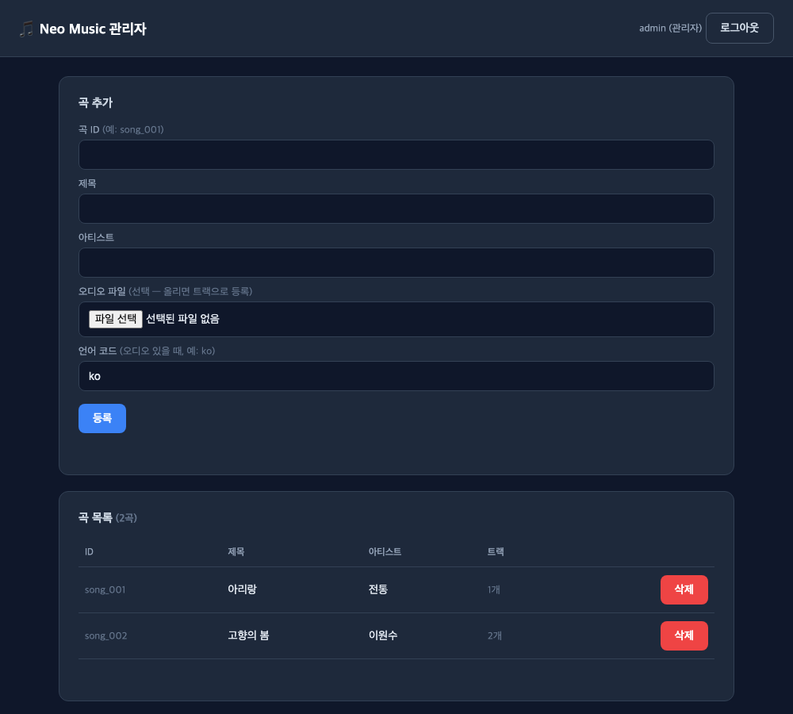

# Neo Music Backend

[](https://github.com/hyobin1448/neo-music-backend/actions/workflows/ci.yml)

> 다국어 오디오 · **가사 위에 기타 코드**를 제공하는 뮤직/코드 플레이어의 백엔드
> Kotlin + Spring Boot · **헥사고날 아키텍처 + DDD**

Flutter 앱 *Neo Music*의 실제 서버이자, 아키텍처·테스트·API 설계를 보여주기 위한 포트폴리오 프로젝트입니다.
곡은 서버가 배포하고, 앱은 **델타 동기화**로 바뀐 것만 내려받아 로컬에서 재생합니다.

---

## 🖥 관리자 화면 (`/admin`)

브라우저에서 로그인 → 곡 등록·오디오 업로드·삭제. (Thymeleaf 셸 + 기존 REST API 재사용)



---

## ✨ 주요 기능

- **회원가입/로그인** — 닉네임 + 비밀번호만 (개인정보 0). BCrypt 해싱, 로그인 5회 실패 시 계정 잠금
- **카탈로그 델타 동기화** — 전역 버전 기반으로 "바뀐 곡 · 삭제된 곡"만 전달 (tombstone)
- **관리자 곡 관리** — 등록/수정/삭제 (권한 분리, JWT 인증)
- **관리자 회원 관리** — 비밀번호 초기화(+잠금 해제)
- **서버 기동 시 관리자 계정 자동 생성** (설정값 기반, 멱등)
- **Swagger UI** — 브라우저에서 API 확인·호출

---

## 🛠 기술 스택

| 구분 | 사용 |
|---|---|
| 언어/런타임 | Kotlin 1.9, Java 17 |
| 프레임워크 | Spring Boot 3.3, Spring Web, Spring Data JPA |
| 인증 | JWT (jjwt), BCrypt (spring-security-crypto) |
| DB | H2 (기본 · 인메모리) / **PostgreSQL 16** (`postgres` 프로필 · docker compose) |
| 문서 | springdoc-openapi 3 (Swagger UI) |
| 테스트 | Kotest, MockK, Spring Boot Test, ArchUnit |

---

## 🏛 아키텍처 — 헥사고날(Ports & Adapters) + DDD

업무 규칙(도메인)을 한가운데 두고, 기술(웹·DB·JWT)은 바깥에서 어댑터로 꽂습니다.
**의존성은 항상 안쪽을 향합니다: `adapter → application → domain`**. 도메인은 프레임워크를 전혀 모릅니다.

```
com.hyobin.neomusic
├── catalog/                  # 곡 카탈로그 (기능별 패키지)
│   ├── domain/               # Song(애그리거트), Track, Lyric, 값 객체 — 순수 Kotlin
│   ├── application/           # 유스케이스 + 포트(인터페이스)
│   │   ├── port/inbound/      #   들어오는 규약 (GetCatalog, RegisterSong, ...)
│   │   └── port/outbound/     #   나가는 규약 (SaveSong, LoadSong, ...)
│   └── adapter/
│       ├── inbound/web/       # REST 컨트롤러 (HTTP → 유스케이스)
│       └── outbound/persistence/  # JPA 구현 (포트 → DB)
├── auth/                     # 인증/회원 (같은 구조)
└── common/                   # 설정, 전역 예외 처리, 웹 공통
```

### 설계 하이라이트

- **애그리거트 불변식을 도메인이 강제** — 예: "한 곡에 같은 언어의 오디오는 하나만". REST로 우회 입력해도 도메인에서 막혀 `400`.
- **값 객체(Value Object)** — `SongId`, `Lang`, `StorageKey` 등이 생성 시점에 자기 검증 → 이후 코드는 항상 유효한 값만 다룸.
- **델타 동기화** — 변경 때마다 전역 버전을 올려 곡에 스탬프. `GET /catalog?since=N`은 N 이후 바뀐 곡 + 삭제된 id만 반환. 삭제는 물리 삭제가 아니라 tombstone이라 앱에도 "삭제됨"이 전파됨.
- **서명 다운로드 URL** — 저장 키를 그대로 노출하지 않고, HMAC 서명 + 만료 시각이 붙은 URL로만 파일을 받게 함. 카탈로그 응답이 키를 서명 URL로 변환해 내려줌. 저장소는 `FileStoragePort`로 추상화(로컬 → S3 교체 용이).
- **아키텍처를 테스트로 강제** — "의존성은 안쪽을 향한다"를 README 문장으로만 두지 않고 **ArchUnit 규칙 7개**로 고정했다. 규칙을 깨는 import 가 들어오면 CI 가 실패해 머지를 막는다. → [`ArchitectureTest.kt`](src/test/kotlin/com/hyobin/neomusic/ArchitectureTest.kt)
- **바운디드 컨텍스트 간 경계** — 컨텍스트끼리는 공개된 `application` 계층으로만 대화하고 서로의 `domain`·`adapter` 는 참조하지 않는다. 인증·인가 예외처럼 모든 컨텍스트에 걸치는 개념은 `common/domain` 으로 올려 특정 컨텍스트에 종속되지 않게 했다.
- **불필요한 전체 시큐리티 배제** — 엔드포인트를 막지 않도록 BCrypt만 사용하고, 경량 JWT 필터 + ArgumentResolver로 인증을 직접 조립.

---

## 🚀 실행

```bash
./gradlew bootRun          # 기본 프로필 — H2 인메모리, 설정 없이 바로 뜬다
```

실제 DB(PostgreSQL)로 띄우려면:

```bash
docker compose up -d                                              # postgres:16 (호스트 5433)
./gradlew bootRun --args='--spring.profiles.active=postgres'
```

- API: `http://localhost:8080`
- **관리자 웹 UI**: `http://localhost:8080/admin` (브라우저에서 로그인 → 곡 등록/업로드/삭제)
- **Swagger UI**: `http://localhost:8080/swagger-ui.html` (Authorize에 로그인 토큰 입력 → 관리자 API 호출)
- H2 콘솔: `http://localhost:8080/h2-console` (JDBC `jdbc:h2:mem:neomusic`, user `sa`, 비번 없음)
- 기본 관리자 계정: `admin` / `admin1234` (서버 기동 시 자동 생성, 운영에서는 환경변수로 교체)

---

## 📚 API 요약

| 메서드 | 경로 | 설명 | 권한 |
|---|---|---|---|
| POST | `/auth/signup` | 회원가입 | 공개 |
| POST | `/auth/login` | 로그인 (JWT 발급) | 공개 |
| GET | `/catalog` | 카탈로그 동기화 (`?since=`로 델타) | 공개 |
| GET | `/catalog/search` | 곡 검색 (`?q=` 제목·아티스트) | 공개 |
| POST/GET | `/playlists` | 플레이리스트 생성 / 내 목록 | 인증 |
| PUT/DELETE | `/playlists/{id}` | 이름 변경 / 삭제 | 소유자 |
| POST/DELETE | `/playlists/{id}/songs` | 곡 추가 / 제거·순서변경 | 소유자 |
| POST | `/admin/songs` | 곡 등록 (중복 시 409) | 관리자 |
| PUT | `/admin/songs/{id}` | 곡 수정 (없으면 404) | 관리자 |
| DELETE | `/admin/songs/{id}` | 곡 삭제 (소프트) | 관리자 |
| POST | `/admin/files` | 파일 업로드 → key·checksum 반환 | 관리자 |
| PUT | `/admin/members/{id}/password` | 비밀번호 초기화 | 관리자 |
| GET | `/files/{key}` | 파일 다운로드 (서명 URL 필요) | 서명 |

인증이 필요한 요청은 헤더에 `Authorization: Bearer <accessToken>`.

---

## ✅ 테스트

```bash
./gradlew test
```

**총 104개 통과.**

- **단위** — 도메인 규칙(Kotest), 유스케이스(MockK)
- **슬라이스** — 컨트롤러 인증/인가(`@WebMvcTest`), 영속성 왕복(`@DataJpaTest`)
- **통합** — 델타 동기화 시나리오, 로그인 잠금(실 DB 커밋 검증)
- **아키텍처** — 계층·컨텍스트 의존 방향을 ArchUnit 으로 검증 (아래)
- **실 DB** — 스키마 생성과 델타 동기화를 **실제 PostgreSQL** 에서 검증 (아래)
- **쿼리 카운트** — 목록 조회의 N+1 재발을 실제 발생 쿼리 수로 감시(`SongSearchQueryCountTest`)

### 아키텍처 테스트 (ArchUnit)

| 규칙 | 막는 것 |
|---|---|
| `domain` 은 프레임워크에 의존하지 않는다 | 도메인에 스프링·JPA·JWT·Jackson 이 새어 들어오는 것 |
| `domain` 은 바깥 계층을 모른다 | 의존 방향이 뒤집히는 것 |
| `application` 은 `adapter` 를 모른다 | 유스케이스가 구현체에 직접 묶이는 것 |
| `application` 은 영속성·웹 기술을 모른다 | 저장소·전송 방식 교체 시 유스케이스가 함께 무너지는 것 |
| JPA 엔티티는 outbound persistence 어댑터 안에만 | DB 스키마가 도메인 모델을 끌고 다니는 것 |
| 컨텍스트는 다른 컨텍스트의 내부를 참조하지 않는다 | 컨텍스트 경계가 흐려지는 것 |
| 컨텍스트 간 순환 의존이 없다 | 나중에 떼어내거나 따로 배포할 수 없게 되는 것 |

> `application` 의 `@Service`·`@Transactional` 은 **의도적으로 허용**합니다. 빈 등록과 트랜잭션 경계 선언에만 쓰고, 그 외 스프링 기능(web·data·http)이 유스케이스로 새어 들어오는 것은 규칙으로 막습니다. 순수성을 100% 고집하기보다 실용적인 선을 정하고 **그 선을 테스트로 지키는 쪽**을 택했습니다.

### 실제 PostgreSQL 검증

H2 는 타입·예약어·제약조건을 느슨하게 받아주기 때문에, **H2 에서는 통과하지만 운영 DB 에서 깨지는** 매핑 문제를 놓칩니다.
그래서 스키마 생성과 핵심 시나리오(델타 동기화 등록→수정→삭제)만큼은 실제 PostgreSQL 에서 확인합니다.

```bash
docker compose up -d && ./gradlew test
```

- CI 에서는 `postgres` **서비스 컨테이너**가 항상 떠 있어 매 푸시마다 실행됩니다.
- 로컬에 DB 가 없으면 이 테스트는 **실패가 아니라 건너뜁니다**. DB 없이 클론한 사람의 `./gradlew test` 를 깨지 않기 위해서입니다.
- → [`PostgresCatalogSyncIntegrationTest.kt`](src/test/kotlin/com/hyobin/neomusic/catalog/PostgresCatalogSyncIntegrationTest.kt)

> `postgres` 프로필은 로컬 확인용이라 `ddl-auto: update` 를 씁니다. 운영에서는 `validate` 로 두고 Flyway 등 마이그레이션 도구로 스키마를 관리해야 합니다.

> 통합 테스트로 실제 버그를 잡은 사례: 로그인 실패 카운트를 저장한 뒤 예외를 던지자
> `@Transactional`이 롤백하며 카운트가 취소되어 계정이 잠기지 않던 문제 →
> `noRollbackFor`로 수정. 목 테스트로는 재현되지 않아 실 DB 통합 테스트를 추가.

---

## 🗺 로드맵

- [x] 카탈로그 델타 동기화 (등록/수정/삭제)
- [x] 인증 (회원가입/로그인/JWT/잠금)
- [x] 관리자 곡·회원 관리
- [x] Swagger / OpenAPI 문서
- [x] 파일 스토리지 (업로드 + 서명 다운로드 URL)
- [x] 곡 검색 (제목/아티스트)
- [x] 플레이리스트 (여러 개·이름·순서, 소유권 검증)
- [x] CI (GitHub Actions — 푸시마다 빌드·테스트)
- [x] 관리자 웹 UI (Thymeleaf — 로그인/곡 등록·업로드·삭제, `/admin`)
- [x] 아키텍처 테스트 (ArchUnit — 계층·컨텍스트 의존 방향 강제)
- [x] 실제 PostgreSQL 통합 테스트 (docker compose + CI 서비스 컨테이너)
- [ ] 가사 텍스트 검색 (가사 구조화 후)
